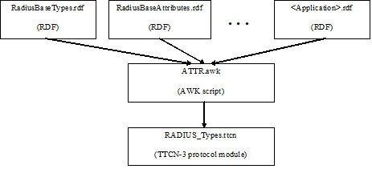
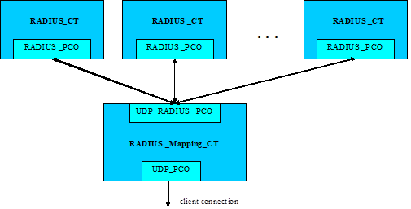
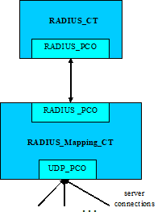

= RADIUS Protocol Module Generator for TTCN-3 Toolset with TITAN, Description
:author: László Farkas
:revnumber: 1551-CNL 113 600, Rev. E
:revdate: 2014-07-17
:toc:

=== How to Read This Document

This is the Function Specification of the RADIUS Protocol Module Generator. The RADIUS Protocol Module Generator is developed for the TTCN-3 Toolset with TITAN.

=== Presumed Knowledge

To use this protocol module the knowledge of the TTCN-3 language <<_2, [2]>> is essential.

Basic knowledge of the RADIUS protocol <<_1, [1]>> is valuable to use this protocol module.

= Functionality

== Product Contents, Structure

The major parts of RPMG are:

a. _ATTR.awk_ script: This is the most important part of the product.

b. A pair of encoder and decoder functions to invoke RAW encoder/decoder.

c. __RADIUS_Mapping.ttcn__ module: provide the authentication.

The RADIUS Base Protocol <<_1, [1]>> and other RADIUS applications are specified in RDFs developed by TCC as part of the RPMG product.

The TTCN-3 module (`RADIUS_Types`) that is generated by the script varies between applications, thus it is NOT a product.

== Protocol Version Implemented

Currently the following applications are supported:

[width="100%",cols="85%,15%",options="header",]
|=====================================================
|RDFs |Refs.
|__BaseTypes_IETF_RFC2865.rdf__ |<<_1,[1]>>
|__Accounting_IETF_RFC2866_RFC2867.rdf__ |<<_5, [5]>>, <<_12, [12]>>
|__TunnelAuthentication_IETF_RFC2868.rdf__ |<<_6, [6]>>
|__Extensions_IETF_RFC2869.rdf__ |<<_7, [7]>>
|__IPv6_IETF_RFC3162.rdf__ |<<_8, [8]>>
|__DynamicAuthorizationExtensions_IETF_RFC5176.rdf__ |<<_9, [9]>>
|__ChargeableUserIdentity_IETF_RFC4372.rdf__ |<<_10, [10]>>
|__GGSN_FS_46_15517_CSA113_4RevB.rdf__ |<<_11, [11]>>
|=====================================================

[width="100%",cols="85%,15%",options="header",]
|===============================
|Vendor specific RDFs |Refs.
|_Cisco.rdf_ |
|_Juniper.rdf_ |
|_Scap.rdf_ |
|_Smartedge.rdf_ |<<_13, [13]>>
|_Vendor.rdf_ |
|_skt.rdf_ |
|__Vendor_detailed_ericsson.rdf__ |
|===============================

[width="100%",cols="85%,15%",options="header",]
|=======================================
|RDFs (in obsolate) |Refs.
|_RadiusBaseTypes.rdf_ |<<_1, [1]>>
|_RadiusAccountingAttributes.rdf_ |<<_5, [5]>>
|_TunnelAuthenticationAttributes.rdf_ |<<_6, [6]>>
|_RadiusExtensions.rdf_ |<<_7, [7]>>
|_RadiusAndIPv6.rdf_ |<<_8, [8]>>
|_RadiusAuthExtensions.rdf_ |<<_9, [9]>>
|_RadiusGGSN.rdf_ |<<_11, [11]>>
|=======================================

== Routing Functionality

Routing functionality is not performed.

== Modified and Non-Implemented Protocol Elements

None.

== Ericsson-Specific Changes

None.

== Backward Incompatibilities

None.

== System Requirements

The RADIUS protocol module generator consist of several RDF files, contains different application definitions of RADIUS protocols and an AWK script which read the RDF files and generates the __RADIUS_Types.ttcn__ type definition module.

Protocol modules are a set of TTCN-3 source code files that can be used as part of TTCN-3 test suites only. Hence, protocol modules alone do not put specific requirements on the system used. However, in order to compile and execute a TTCN-3 test suite using the set of protocol modules the following system requirements must be satisfied:

* TITAN TTCN-3 Test Executor R7A (1.7.pl0) or higher installed. For installation guide see <<_14, [14]>>.

NOTE: This version of the protocol module is not compatible with TITAN releases earlier than R7A.

* The RADIUS protocol module generator contains functions, use MD5 checksum, so the same OpenSSL must be installed as used in TITAN. For installation guide see <<_16, [16]>>.

= Feature List

== Background

Former solution for testing RADIUS applications is based on the RADIUS Test Port. This test port implies a number of limitations:

1.  Attributes and other application-specific data are hard-coded in the Test Port, which makes the extension hard. New Attributes need to be added, encoded and decoded manually.
2.  The support of different revisions of same RADIUS application may required by different projects. Different revisions may contain, for example, overlapping Attribute codes or other contradictory type definitions, which can only be handled using run-time switches.

RPMG provides solution to this problem by dynamically generating the type definition module containing the Attributes and definitions of the chosen applications.

The generated protocol module implements the message structures of the RADIUS protocol in a formalized way, using the standard specification language TTCN-3. This allows defining of test data (templates) in the TTCN-3 language <<_2, [2]>> and correctly encoding/decoding messages when executing test suites using the Titan TTCN-3 test environment.

The protocol module uses Titan’s RAW encoding attributes <<_3, [3]>> for RADIUS encoder and hence is usable with the Titan test toolset only.

== Architecture

The dynamically generated protocol module is assembled from one or more RDFs using a script. The RDFs – which are not valid TTCN-3 modules – contain TTCN-3 type definitions of Attributes of RADIUS applications. One RDF MUST NOT contain more than one application but applications MAY be split into several RDFs.

See the RPMG architecture below:

The naming of RDFs should follow the `<Official-Application-Name>Attributes_ <Application-Version>` scheme. The extension MUST NOT be _.ttcn_; _.rdf_ is recommended.

If the application uses only a minor sub-set of some standard specification then it is acceptable to define these Attributes in the framework of the new application instead of including all unnecessary Attributes of the standard.

The type definitions for testing protocols complying the RADIUS Base Specification are split in two RDFs:

[width="100%",cols="35%,65%",options="header",]
|================================================================================================
|RDF name |Contents
|_RadiusBaseTypes_ |Remote Authentication Dial In User Service <<_1, [1]>> related type definitions
|_RadiusBaseAttributes_ |Remote Authentication Dial In User Service <<_1, [1]>> Attributes type definitions
|================================================================================================

Or using the latest RDF interface:

[width="100%",cols="35%,65%",options="header",]
|===================================================================================================
|RDF name |Contents
|__BaseTypes_IETF_RFC2865.rdf__ |Remote Authentication Dial In User Service <<_1, [1]>> related type definitions
|__Base_IETF_RFC2865.rdf__ |Remote Authentication Dial In User Service <<_1, [1]>> Attributes type definitions
|===================================================================================================

The _ATTR.awk_ script merges its argument RDFs into a single valid TTCN-3 module called `RADIUS_Types` by default.

The input RDFs must comply with the naming and typographical conventions described herein in order for the _ATTR.sh_ script to produce a syntactically and semantically valid TTCN3 module.

The script can be optionally invoked with an option. This option modifies the script operation. The option must appear in the argument list before the RDF files. It is introduced with the –v flag and must not immediately follow the –v flag; whitespace separation is required. The option itself must be written in one word.

The supported option is:

* `old_structured_code`: This option results the original structured `RADIUS_Types` generated module. This option is disabled by default.

* `module_id`: This option can be used to alter the identifier of generated TTCN-3 module. The `module_id` shall be a valid TTCN-3 identifier.

* `use_application_revision`: This option results the application revision string to be added as prefix to generated identifiers. The application revision string is hardcoded into the input DDF files. This option is disabled by default.

* `enum_2_UnsignedInt`: This option makes the script to replace all enumeration type attributes, which are found in input RDF files, to typeUnsigned32. This option is disabled by default.

[[naming_conventions]]
== Naming Conventions

The generated identifiers of types are based on information provided in comments within the RDFs themselves.

1.  Applications are distinguished using the unique `<Application-Name>`, which is assigned by TCC. The `<Application-Name>` is used to prefix type as well as certain field identifiers in the generated `RADIUS_Types` module to ensure unique naming. The `<Application Revision>` is only optionally used in prefixes. The `<Application-Name>` and `<Application Revision>` are hard-coded in each RDF file using the following format:
+
[source]
----
// APPLICATION-NAME: Auth
// APPLICATION-REVISION: RFC2868
----

2.  Attribute properties (e.g. name, code) are enlisted in C++ style comment right before the Attribute type definition using the following format:
+
[source]
----
// Attrib: <Official-Attribute-Name> (<Official-Attribute-Code>)
type Type_Specifier Official_Attribute_Name …
----

3.  The entire comment line with the information MUST stand in the same line (no line breaks when it splits to multiple lines).
4.  The TTCN-3 type definition following a properly formed comment line is interpreted as an Attribute definition, if the type identifier matches the `<Official-Attribute-Code>` appearing in the comment before.
5.  The `<Official-Attribute-Name>` and `<Official-Attribute-Code`> shall come from the relevant RFC, IETF Draft or other specification.
6.  The TTCN-3 identifiers used in `<Official-Attribute-Name>` must keep the original naming except when this collides with TTCN-3 identifier’s naming rules:
+
a. Hyphens and spaces must be replaced by a single underscore

b. Trailing "Attribute" MUST be omitted if not part of the name

7.  The `<Official-Attribute-Code>` must be given as integer numbers!

=== Key to Unique Naming of Identifiers

The following uniqueness criteria – derived from RADIUS <<_1, [1]>> – must hold for identifiers used in RDFs:

1.  `<Application-Name>` MUST be globally unique: each application identifier must be formulated so that it is always unique.
+
Example: `<Application-Name>s: BASE, Acc`

2.  `<Official-Attribute-Name>` may not be unique: It happens that the same Attribute name is used in the same or in different RADIUS applications. The script is designed to cope with this, thus it is recommended to keep the standard Attribute name with respect to naming conventions.

3.  `<Official-Attribute-Code>` MUST be globally unique (except within different revisions of the same application!) since this 8Bits number determines the Attribute.

[[how_to_model_enumeration_type_attributes_in_RDFs]]
=== How to Model Enumeration Type Attributes in RDFs?

It is important to ensure the unique naming of enumeration type identifiers and enumeration items. The enumerated type Attributes require one type definition: The enumerated type definition containing the valid enumeration items. The identifier of the enumeration type shall be `<Official-Attribute-Name>`.

All enumerations in RDFs get the following attributes automatically assigned to enumeration type Attributes' enumerations:

[source]
----
with {
variant "FIELDLENGTH(X)"
variant "BYTEORDER(last)"
variant "COMP(2scompl)"
}
----

The `FIELDLENGTH` attribute depends on the length of the field. The enumeration type identifiers and enumeration items are variable in length; these must be defined in RDFs. The type name contains the length in the following way: the enumerated word is replaced with the enum, and the length of the field is written after the enum, and there must be an underline char between the enum word and the length of the enumeration type.

The following example shows how to define for example a 8-bit-long enumerated type Attribute:

[source]
----
// Attrib: <Official-Attribute-Name> (<Official-Attribute-Code>)
type enum_8 Official_Attribute_Name
{
 …
}
----

A 32-bit-long enumeration type can be defined otherwise, simply use the word: enumerated.

=== How to Model Code Enumeration Type in RDFs?

Code enumeration type can be extended in RADIUS applications. RPMG merges them together into a single type definition with proper attributes. The generated code enumeration type is based on information provided in comments within the RDFs themselves.

Code properties (e.g. name, code) are enlisted in C++ style comment using the following format:

[source]
// Packet-Type: <Official-Code-Name> (<Official-Code-Code>)

== Vendor Specific Attribute Handling

The vendor id and the details of the type definition of the vendor specific attributes can be defined in the RDFs.

=== Vendor ID Definition

The vendor id and the vendor name should be defined in the following forms:

[source]
// Vendor: <Vendor_name> (<Vendor-Code>)

Example:

[source]
// Vendor: ericsson (193)

=== Mandatory Type Definitions

The following types should be defined for a vendor specific attributes:

[source]
----
type set of <Vendor_name>_type <Vendor_name>_subattr_list;

type enum_8 <Vendor_name>_type_enum{
...
}

type record <Vendor_name>_type
{
  <Vendor_name>_type_enum              f_<Vendor_name>_type,
  UINT8                           attrib_length_spec,
  <Vendor_spec_type>                     string_val
} with {
  variant (attrib_length_spec) "LENGTHTO(f_<Vendor_name>_type, attrib_length_spec, string_val)"
  }
----

The `<Vendor_spec_type>` can be:

* octetsring
* `vendor_specific_value`, defined in __BaseTypes_IETF_RFC2865.rdf__
* other user specified type

== Script Operation

The TTCN-3 module, containing all relevant type definitions, is generated automatically from the relevant RDFs by a script. This will ensure that no collision can appear between proper RADIUS applications.

The top-level RADIUS PDU to send/receive is always `PDU_RADIUS`.

=== Load and Parse All Input Files

If overlapping Attribute codes (same Attribute code) are found during parsing of RDFs then the created `RADIUS_Types` module will not compile!

In this case at the end of the `RADIUS_Types` module the following error message has been appeared:

`*ERROR: attrib_descriptors () != matching_attrib_types ()*`

with the number of elements in the brackets.

=== Type Identifiers

The script changes Attribute type identifiers in order to avoid name collisions. The `<Official-Application-Name>` will prefix the `Official_Attribute_Name` defined in RDF. Example:

Attribute type definition in RDF:

[source]
----
// RFC 2865
// Attrib: User-Name (1)
type Attrib_String User_Name;
----

The corresponding type definition in the generated module:

[source]
----
// RFC 2865
// Attrib: User-Name (1)
type Attrib_String Base_User_Name
----

In the original styled `RADIUS_Types` module (using `old_structured_code` option of the awk script) there are generated Attribute types. These types are not included in new styled `RADIUS_Types` module. Each generated Attribute type is a record consists of three fields: the type `attrib_type`, the length `attrib_length` and the field with the value of `_"Attribute"_`.

Example:

[source]
----
type record Attrib_Base_User_Name
{
  Attrib attrib_type,
  UINT8 attrib_length,
  Base_User_Name base_user_name
} with {
   variant "PRESENCE (attrib_type=Base_User_Name)"
   variant (attrib_length) "LENGTHTO(attrib_type, attrib_length, base_user_name)"
  }
----

=== Attrib

All Attributes code is in a single enumerated type. Attrib enumeration type is merged together from the Attributes definitions of the RDF files by the AWK script. All enumeration item defined in different application are collected together and written to the generated __RADIUS_Types.ttcn__ file. Proper encoding attributes are added to the Attrib type by the script.

[source]
----
type enumerated Attrib
{
  Base_User_Name (1),
	…
} with {
  variant "FIELDLENGTH(8)"
  variant "BYTEORDER(last)"
  variant "COMP(2scompl)"
}
----

[[attrib-data]]
=== Attrib_Data

There is `Attrib_Data` type in the new styled `RADIUS_Types` module. This type is not included in original styled `RADIUS_Types` module. The `Attrib_Data` type is a generated union type containing all Attribute types found in the RDFs:

[source]
----
type union Attrib_Data
{
  Base_User_Name base_user_name,
  …,
  octetstring attrib_UNKNOWN
}
----

=== GenericAttrib

In the original styled `RADIUS_Types` module (using `old_structured_code` option of the awk script) the `GenericAttrib` type is a generated union type containing all Attribute types found in the RDFs:

[source]
----
type union GenericAttrib {
  Attrib_<Application-Name>_<Official-Attribute-Name>
        attrib_<Application-Name>_<Official-Attribute-Name>,
  Attrib_UNKNOWN attrib_UNKNOWN
}
----

`attrib_UNKNOWN` will contain the erroneous Attribute when something went wrong during the decoding of the Attribute data (in the original and the new style generated code).

[source]
----
type record Attrib_UNKNOWN
{
  UINT8 attrib_type,
  UINT8 attrib_length,
  octetstring attrib_value
} with {
   variant (attrib_length) "LENGTHTO(attrib_type, attrib_length, attrib_value)"
  }
----

In the new styled `RADIUS_Types` module the `GenericAttrib` type is a record consists of three fields: the `type` `attrib_type`, the `length` `attrib_length` and the `Attrib_Data` typed `attrib_data`.

[source]
----
type record GenericAttrib
{
  Attrib attrib_type,
  UINT8 attrib_length,
  Attrib_Data attrib_data
} with {
   variant (attrib_length) "LENGTHTO(attrib_type, attrib_length, attrib_data)"
   variant (attrib_data) "CROSSTAG(
base_user_name,attrib_type=Base_User_Name;
…;
attrib_UNKNOWN, OTHERWISE
   )"
}
----

=== GenAttrib

There is `GenAttrib` type in the new styled `RADIUS_Types` module. This type is not included in original styled `RADIUS_Types` module. The `GenAttrib` type is a generated union type containing the `generic_Attrib` and the `attrib_UNKNOWN`.

[source]
----
type union GenAttrib
{
  GenericAttrib genericAttrib,
  Attrib_UNKNOWN attrib_UNKNOWN
}
----

=== Attribs

Attribs is a list of Attributes (set of `GenericAttrib`) in the original styled `RADIUS_Types` module.

Attribs is a list of GenAttrib in the new styled `RADIUS_Types` module.

=== Code (Packet type)

Code enumeration type is merged together from the RDF file of different application’s Code definition by the AWK script. All enumeration item defined in different application are collected together and written to the generated __RADIUS_Types.ttcn file__. Proper encoding attributes are added to the Code type by the script.

=== Output TTCN-3 Module

All definitions of RDF files, which are not subject to change are written to the output __RADIUS_Types.ttcn__ file as is.

== Using the Script

The _ATTR.awk_ script can be executed with GNU AWK <<_4, [4]>> and its output MUST be redirected into __"RADIUS_Types.ttcn"__!

= Functional Specification

== Product Contents, Structure

The major parts of RPMG are:

* _ATTR.awk_ script: This is the most important part of the product.

* A pair of encoder and decoder functions to invoke RAW encoder/decoder.

* __RADIUS_Mapping.ttcn__ module: provide the authentication.

The RADIUS Base Protocol <<_1, [1]>> and other RADIUS applications are specified in RDFs developed by TCC as part of the RPMG product.

The TTCN-3 module (`RADIUS_Types`) that is generated by the script varies between applications, thus it is NOT a product.

[[encoding-decoding-and-other-related-functions]]
== Encoding/Decoding and Other Related Functions

This product also contains encoding/decoding functions that assure correct encoding of messages when sent from Titan and correct decoding of messages when received by Titan. Implemented encoding/decoding functions:

[cols=3*,options=header]
|===

|Name
|Type of formal parameters
|Type of return value

|`f_RADIUS_Enc`
|(in PDU_RADIUS pdu)
|octetstring;

|`f_RADIUS_Dec`
|(in octetstring stream)
|PDU_RADIUS;
|===

Two separate external functions are available for encrypting the password and calculating the Authenticator:

[cols=3*,options=header]
|===

|Name
|Type of formal parameters
|Type of return value

|`f_crypt_password`
|(in octetstring P, octetstring; in octetstring req_auth, in octetstring salt, in boolean decrypt, in charstring secret)
|octetstring

|`f_calc_MD5`
|(in octetstring input)
|octetstring;

|`f_crypt_s_key`
|(in octetstring pl_s_key, octetstring in octetstring pl_req_auth in charstring secret in boolean decrypt)
|octetstring

|`f_crypt_tunnel_password`
|(in octetstring pl_password octetstring in octetstring req_auth in octetstring salt in charstring secret in Boolean decrypt)
|octetstring
|===

Other functions are available in `PPP_CNL113599` Protocol Module to encode and decode EAP Messages which can be encapsulated in EAP-Message Attribute (Type: 79)

== Protocol Version Implemented

Currently the following applications are supported:

[width="100%",cols="85%,15%",options="header",]
|=====================================================
|RDFs |Refs.
|__BaseTypes_IETF_RFC2865.rdf__ |<<_1, [1]>>
|__Accounting_IETF_RFC2866_RFC2867.rdf__ |<<_5, [5]>>, <<_12, [12]>>
|__TunnelAuthentication_IETF_RFC2868.rdf__ |<<_6, [6]>>
|__Extensions_IETF_RFC2869.rdf__ |<<_7, [7]>>
|__IPv6_IETF_RFC3162.rdf__ |<<_8, [8]>>
|__DynamicAuthorizationExtensions_IETF_RFC5176.rdf__ |<<_9, [9]>>
|__ChargeableUserIdentity_IETF_RFC4372.rdf__ |<<_10, [10]>>
|__GGSN_FS_46_15517_CSA113_4RevB.rdf__ |<<_11, [11]>>
|=====================================================

[width="100%",cols="85%,15%",options="header",]
|===============================
|Vendor specific RDFs |Refs.
|_Cisco.rdf_ |
|_Juniper.rdf_ |
|_Scap.rdf_ |
|_Smartedge.rdf_ |<<_13, [13]>>
|_Vendor.rdf_ |
|_skt.rdf_ |
|__Vendor_detailed_ericsson.rdf__ |
|===============================

[width="100%",cols="85%,15%",options="header",]
|=======================================
|RDFs (in obsolate) |Refs.
|__RadiusBaseTypes.rdf__ |<<_1, [1]>>
|__RadiusAccountingAttributes.rdf__ |<<_5, [5]>>
|__TunnelAuthenticationAttributes.rdf__ |<<_6, [6]>>
|__RadiusExtensions.rdf__ |<<_7, [7]>>
|__RadiusAndIPv6.rdf__ |<<_8, [8]>>
|__RadiusAuthExtensions.rdf__ |<<_9, [9]>>
|__RadiusGGSN.rdf__ |<<_11, [11]>>
|=======================================

= Protocol Modules

== Overview

Protocol modules implement the message structure of the related protocol in a formalized way, using the standard specification language TTCN-3. This allows defining of test data (templates) in the TTCN-3 language <<_3, [3]>> and correctly encoding/decoding messages when executing test suites using the Titan TTCN-3 test environment.

See the RPMG Architecture below:

The RADIUS protocol module (__RADIUS_Types.ttcn__) is generated dynamically from the needed RDF files with the help of an AWK script (see figure above). The produced protocol module uses Titan’s RAW encoding attributes for encoding and decoding and hence it is usable with the Titan test toolset only.

== Installation

The set of protocol modules can be used for developing TTCN-3 test suites using any text editor. However, to make the work more efficient a TTCN-3-enabled text editor is recommended (e.g. `nedit`, `xemacs`). Since the RADIUS protocol is used as a part of a TTCN-3 test suite, this requires Titan TTCN-3 Test Executor be installed before the module can be compiled and executed together with other parts of the test suite. For more details on the installation of TTCN-3 Test Executor see the relevant section of <<_14, [14]>>.

The _ATTR.sh_ shell script runs on Bourne Shell, which is usually available on all UNIX like workstations. The _ATTR.awk_ script, which processes the RDF files and creates the RADIUS protocol module, can be executed with GNU AWK version 3.1.6 or later <<_4, [4]>> so it must be available on the system.

[[compilation]]
== Compilation

First you need to obtain the required RDF files. After you have the RDF files containing the definitions of the selected RADIUS applications, you can generate the proper __RADIUS_Types.ttcn__ module by issuing the following command:

[source,subs="quotes"]
ATTR.sh RadiusBaseAttributes.rdf RadiuaBaseTypes.rdf _OtherApplications.rdf_

or

[source,subs="quotes"]
gawk -f ATTR.awk RadiusBaseAttributes.rdf RadiuaBaseTypes.rdf _OtherApplications.rdf_ > RADIUS_Types.ttcn

The script can be optionally invoked with some options. This options modify the script operation. The options must appear in the argument list before the RDF files. It is introduced with the –v flag and must not immediately follow the –v flag; whitespace separation is required. The option itself must be written in one word.

The supported option is:

* `old_structured_code` - This option results the original structured `RADIUS_Types` generated module. This option is disabled by default.

* `module_id` - This option can be used to alter the identifier of generated TTCN-3 module. The `module_id` shall be a valid TTCN-3 identifier.

* `use_application_revision` - This option results the application revision string to be added as prefix to generated identifiers. The application revision string is hardcoded into the input DDF files. This option is disabled by default.

* `enum_2_UnsignedInt` - This option makes the script to replace all enumeration type attributes, which are found in input RDF files, to typeUnsigned32. This option is disabled by default.

The next command stores the generated TTCN-3 definitions in original structured module XYZ and translates all enumeration type attributes to a proper unsigned integer.

[source]
----
ATTR.sh –v old_structured_code=1 –v module_id=XYZ –v enum_2_UnsignedInt RadiusBaseAttributes.rdf RadiuaBaseTypes.rdf _OtherApplications.rdf_
----

In case you want to add the task of generation of __RADIUS_Types.ttcn__ module into your _Makefile_, you should do the following:

1.  Generate the GNU _Makefile_ for your existing TTCN-3 and C++ files, except __RADIUS_Types.ttcn__.
2.  Add __RADIUS_Types.ttcn__ manually to the list of the TTCN-3 sources into the generated _Makefile_.
3.  Add the following rules to your _Makefile_:

[source,subs="quotes"]
----
AWK=/usr/bin/gawk

RADIUS_Types.ttcn: RadiusBaseTypes.rdf RadiusSBaseAttributes.rdf <Input
FILEs containing Attribute definitions> ATTR.awk
        $(AWK) -f ATTR.awk RadiusBaseTypes.rdf RadiusSBaseAttributes.rdf
<Input FILEs containing Attribute definitions> > $@
----

The location of the AWK depends on the operation system and the distribution.

When you use GUI for building executable, on top of normal project creation you should take care of the following:

1.  Add _ATTR.awk_ script and all RDF files you need to add to the misc files section.

NOTE: You should generate softlinks to the build directory with selecting the files and select 'Generate Softlinks' menu item manually as it is not generated automatically by the GUI.

2.  Create a script to modify the generated _Makefile_ (see clause 5.2.4, for example). List all the RDF files you need when executing the AWK script.
3.  Add script to modify the _Makefile_ in the project properties.
4.  If you want to have the __RADIUS_Types.ttcn__ file added to your project, you can, but after adding, you should exclude the file from build in order to avoid double occurrence in the _Makefile_.

== Helper Functions

The following external functions are available to calculate the Request Authenticator field and check the Response Authenticator field; encrypt and decrypt the password attributes:

[source]

external function f_calc_MD5(in octetstring input) return octetstring;

This function calculates the MD5 hash.

It is important to mention, that if the `Authenticator` field is set to ˛`_"0"_`, the encoder function automatically generates a value with the help of the presented function.

[source]
----
external function f_crypt_password(in octetstring P,in octetstring req_auth,in octetstring salt,in boolean decrypt,in charstring secret) return octetstring;
----

This function calculates the MD5 hash in Attribute User-Password for outgoing and incoming messages according to https://tools.ietf.org/html/rfc2865[RFC 2865], Section 5.2.

[source]
----
external function f_crypt_s_key(in octetstring pl_s_key,in octetstring pl_req_auth,in charstring secret,in boolean decrypt) return octetstring;
----

This function calculates the MD5 hash in cdma2000 subattributum `s_key` for outgoing and incoming messages.

[source]
----
external function f_crypt_tunnel_password(in octetstring P,in octetstring req_auth,in octetstring salt,in boolean decrypt,in charstring secret) return octetstring;
----

This function calculates the MD5 hash in Attribute Tunnel-Password for outgoing and incoming messages according to https://tools.ietf.org/html/rfc2868[RFC 2868], Section 3.5.

EAP functions:

The following functions are available in `PPP_CNL113599` Protocol Module to encode and decode EAP Packets which can be encapsulated in EAP-Message Attribute (Type: 79)

Functions for encode and decode concatenated EAP PDUs:

[source]
----
external function f_enc_PDU_EAP_list(in PDU_EAP_list pdu) return octetstring;
external function f_dec_PDU_EAP_list(in octetstring stream) return
PDU_EAP_list;
----

Functions for encode and decode `eap_sim_attrib_list` and `eap_aka_attrib_list`, these kinds of lists can be encrypted in `AT_ENCR_DATA`:

[source]
----
external function f_enc_eap_sim_attrib_list(in eap_sim_attrib_list pdu) return octetstring

external function f_dec_eap_sim_attrib_list(in octetstring stream) return eap_sim_attrib_list

external function f_enc_eap_aka_attrib_list(in eap_aka_attrib_list pdu) return octetstring

external function f_dec_eap_aka_attrib_list(in octetstring stream) return eap_aka_attrib_list
----

When using EAP messages the value of the `AT_MAC` attribute can be set to `_"zero"_`. In this case it will be calculated automatically. It is possible to put a nonzero value directly into this field. In this case it will be sent without any changes to the remote host. The PPP protocol module supports MAC calculation:

[source]
external function f_calc_HMAC(in octetstring key, in octetstring input, in integer out_length) return octetstring;

Function for initialize port descriptor variable The initialization is very important, the use of a descriptor variable without initialization can generate errors!!!:

[source]
external function f_initEAPPortDescriptor(inout EAP_port_descriptor descriptor);

Using the following function authentication and encryption key generation is automatic:

[source]
external function f_get_EAP_parameters(inout octetstring pl_ext_eap_message,inout EAP_port_descriptor pl_descriptor,in boolean incoming_message)

Since the "Ki" key in EAP SIM and "K" key in EAP AKA also contributes to _Kencr_ it has to be set from the test suite prior to sending or receiving EAP-SIM messages containing `AT_ENCR_DATA` using the following function:

[source]
----
external function f_set_Ki(in integer identifier, in octetstring input, inout EAP_port_descriptor descriptor);
external function f_set_K(in integer identifier, in octetstring input, inout EAP_port_descriptor descriptor);
----

Before sending `AT_AUTN` attribute it is necessary to set `SQN` (`_"6"_` octet long) and `AMF` (`_"2"_` octet long) values and before sending `AT_AUTS` attribute it is necessary to set `SQN_MS` value. The following external functions are available to set these attributes:

[source]
----
external function f_set_SQN(in integer identifier, in octetstring input, inout EAP_port_descriptor descriptor);
external function f_set_SQN_MS(in integer identifier, in octetstring input, inout EAP_port_descriptor descriptor);
external function f_set_AMF(in integer identifier, in octetstring input, inout EAP_port_descriptor descriptor);
----

Authentication and encryption key generating functions:

SIM key calculation:

Function for calculating `n*SRES`:

[source]
external function f_calc_SRES(in octetstring key,in octetstring rand)return octetstring;

Function for calculating `n*Kc` from `Ki` and `AT_RAND`:

[source]
external function f_calc_A3A8(in octetstring key,in octetstring rand)return octetstring;

Function for calculating `Kaut` and `Kenc` from the concatenated input value
(`Identity|n*Kc|NONCE_MT|Version List|Selected Version`):

[source]
external function f_calc_Kaut(in octetstring input,inout octetstring kencr) return octetstring;

AKA key calculation:

The following function calculates the `K_aut`, `K_enc`, `AK` values and returns with `XDOUT`. `K_aut` is used when calculating `MAC` values, and `K_encr` is used for encryption and decryption of `AT_ENCR_DATA` attributes, and `AK` is used for calculating and verifying `AT_AUTN` and `AT_AUTS` values.

[source]
----
external function f_calc_AKA_Keys(in octetstring pl_eap_identity, in octetstring pl_AKA_K, in octetstring pl_rand, inout octetstring pl_AK, inout octetstring pl_Kaut,inout octetstring pl_Kencr) return octetstring
----

Functions for encrypting and decrypting SIM and AKA `AT_ENCR_DATA`:

[source]
----
external function f_encrypt_at_encr(in octetstring key,in octetstring input,in octetstring ivec,in boolean decrypt) return octetstring;

external function f_crypt_atSimEncrData(
  in at_sim_encr_data pl_encr_data,
  in octetstring key,in octetstring ivec,in boolean decrypt)
return at_sim_encr_data;

external function f_crypt_atAKAEncrData(
  in at_aka_encr_data pl_encr_data,
  in octetstring key,in octetstring ivec,in boolean decrypt)
return at_aka_encr_data;
----

Vendor specific attribute handling functions:

Encode/decode salted attribute:

[source]
----
external function f_salt_value(inout vendor_specific_value pdu, in octetstring req_auth, in charstring secret, in boolean decrypt) return boolean;
----
Convert the value of the attribute into text if possible:

[source]
external function f_convert_string_to_text(inout vendor_specific_value pdu) return boolean;

= Upgrading Templates Used by The RADIUS Test Port

The RPMG type structure differs from the one that is used in the RADIUS message test port. This causes backward incompatibilities in the TTCN-3 type definition module. Therefore, functions and templates developed for RADIUS message test port need to be updated according to the changes of the type definition so that they can be used with RPMG.

In case new fields were added into existing record or set types, the new templates should contain these fields set to `_"omit"_`.

In case a type has changed completely the whole template or part of template must be changed.

If a function is accessing a field that has changed that function needs to be updated as well.

Here you can find a list of major changes:

1.  The module name containing RADIUS type definitions has been changed, thus you should replace `RADIUSmsg_Types` by `RADIUS_Types` in import lines of modules using RADIUS type definitions.
2.  The name of top level PDU changed from `RADIUS_message` to `PDU_RADIUS`.
3.  The enumerated type that contains message types is renamed from `message_type` to Code, and the names of enumerated items are capitalized.
4.  The enumerated type that contains Attribute types is renamed from `attrib_type_enum` to Attrib, and the names of enumerated items are changed according to the naming convention of the protocol module generator (see <<naming_conventions, Naming Conventions>>).
5.  The name of the third field of an Attribute record depends on the name of the Attribute instead of its type. For example `base_user_name` is used instead of `string_val`.
6.  The union type `RADIUS_attrib` was modified. Its new name is `GenericAttrib`. A `GenericAttrib` type was introduced for error-handling purposes. Its entire branch contains the correctly decoded Attributes, excepting the last one. If something goes wrong during decoding, the `attrib_UNKNOWN` branch is used, which is of type record.
7.  The field names of the union type `GenericAttrib` are denominated according to the naming convention (see <<naming_conventions, Naming Conventions>>).
8.  All type names of Attributes are changed according to the naming convention (see <<naming_conventions, Naming Conventions>>).
9.  Name of enumeration types and values within Attributes are changed according to <<how_to_model_enumeration_type_attributes_in_RDFs, How to Model Enumeration Type Attributes in RDFs?>>.

= Error Handling

During the encoding and the decoding of a RADIUS message the following error scenarios can be identified:

* If a RADIUS message arrives with a code not known by the RADIUS protocol module, an error message is generated, where the unknown code value appears at `<value>`:
+
`*Warning: While RAW-decoding type `@RADIUS_Types.PDU_RADIUS': Invalid enum value <value> for `@RADIUS_Types.Code'*`

* If the `Code` field of the RADIUS message to be sent is invalid, an error message is generated, where the code value appears at `<value>`:
+
`*Warning : Will not send out Radius message with code <value> in Server/Client mode!*`

* If a RADIUS message arrives with a wrong authentication value, an error message is generated, where the code value appears at `<value>`:
+
`*Warning: Unexpected authentication value received in message with code <value>*`

* In case of an unknown Attribute code, the Attribute is decoded into a special `attrib_UNKNOWN` field. The type of this field is `Attrib_UNKNOWN`. That is a record, which contains three fields (`attrib_type`, `attrib_length`, `attrib_value`) like a normal Attribute with octetstring-type `attrib_value`.

= Examples

The "demo" directory of the deliverable contains examples (__RADIUS_Test_orig.ttcn__, __RADIUS_Test_new.ttcn__, __RadiusAndEAP_Demo.ttcn__) and reusable modules (__RADIUS_Mapping_orig.ttcn__, __RADIUS_Mapping_new.ttcn__, __RADIUSandEAP_Mapping.ttcn__) for RPMG.

== Mapping Module

The `RADIUS_Mapping.ttcn` (`RADIUS_Mapping_orig.ttcn`, `RADIUS_Mapping_new.ttcn`, `RADIUSandEAP_Mapping.ttcn`) module provides the connection between the RADIUS protocol module and the UDP (CNL 113 346) test port. It maintains UDP connections and encodes/decodes RADIUS messages.

The mapping component supports client and server mode operations and sends notifications about the state of the underlying UDP connections to the mapping users.

The module automatically encrypts the User-Password attribute’s String with MD5. It means that the `base_user_password` field of `attrib_Base_User_Password` attribute in TTCN-3 source code has to be in OCTETSTRING format without any MD5 encryption.

NOTE: The `char2oct()` function in TTCN-3 converts the password given in ASCII to OCTETSTRING.

The mapping module calculates the Request Authenticator field and checks the Response Authenticator field.

NOTE: If the Request Authenticator field is `_"zero"_` the mapping module will calculate the MD5 encrypted checksum automatically. It is possible to put a nonzero value directly into this field. In this case the test port will send this value without any changes to the remote host.

In case of incoming response messages the mapping module checks the Response Authenticator field. If any error is detected then the warning message `*Unexpected authentication value received in message with code <value>*`` appears, where the code value appears at <value>.

==== Configuration

The following module parameter is used also in client and server mode:

[width="100%",cols="35%,15%,50%",options="header",]
|=================================================================================================================================================================================
|Parameter Name |Type |Description
|`tsp_SharedSecret` |charstring |Secret shared between the client and the RADIUS server. It should be given in clear text. It is used to calculate and check the authenticator field.
|=================================================================================================================================================================================

The following module parameters are used when PPP EAP is imported:

[width="100%",cols="35%,15%,50%",options="header",]
|========================================================================================================================================================
|Parameter Name |Type |Description
|`tsp_SIM_Ki` |OCT16 |The AKA SQN key will be set automatically with `tsp_SIM_Ki` if it is not set with `f_set_Ki` function.
|`tsp_AKA_K` |OCT16 |The AKA SQN key will be set automatically with `tsp_AKA_K` if it is not set with `f_set_K` function.
|`tsp_AKA_SQN` |OCT6 |The AKA SQN key will be set automatically with `tsp_AKA_SQN` if it is not set with `f_set_SQN` function.
|`tsp_AKA_SQN_MS` |OCT6 |The AKA SQN key will be set automatically with `tsp_AKA_SQN_MS` if it is not set with `f_set_SQN_MS` function.
|`tsp_AKA_AMF` |OCT2 |The AKA SQN key will be set automatically with `tsp_AKA_AMF` if it is not set with `f_set_AMF` function.
|`tsp_skip_auth_encr` |boolean |If this parameter is set to `__`true`__`, the authentication and encryption functionality of EAP-SIM and EAP-AKA is turned off.
|`tsp_global_keying` |boolean |If this parameter is set to `__`true`__`, then the test port uses global keying with EAP-SIM and EAP-AKA.
|`tsp_debugging` |boolean |This parameter can turn on and off some verbose logging.
|========================================================================================================================================================

=== Client Mode

==== Overview

In client mode the `RADIUS_Mapping_CT` initiates connection to the destination host using the `UDP_PCO` port. Several users may connect to the mapping component (see figure above). The users can send `PDU_RADIUS` messages to the mapping component, which will be encoded and will be sent through the `UDP_PCO` port. The mapping component keeps track of the `user_password` attribute and authenticator field of each RADIUS message. The corresponding answers are routed back to the originating user.

The above-described functionality is implemented in separate functions of the __RADIUS_Mapping.ttcn__ module:

1.  `f_handle_outgoing_client_message()`
2.  `f_handle_incoming_client_message()`

=== Server Mode

In server mode the `RADIUS_Mapping_CT` starts listening on a configured port using the `UDP_PCO` port and waits for incoming connections. Only one user component shall connect to the mapping component (See figure above). The user component can send/receive RADIUS messages (`ASP_UDP_RADIUS`).

The above-described functionality is implemented in separate functions of the __RADIUS_Mapping.ttcn__ module:

1.  `f_handle_outgoing_server_message()`
2.  `f_handle_incoming_server_message()`

[[configuration-0]]
==== Configuration

The UDP test port must be configured in the following way:

* `localPort` contains the port number of the server
* Other UDP test port parameters should not be used.

NOTE: In case of UDP the listening interface must be given using the `localPort` UDP test port parameter.

[[attributes-of-the-radiusmsg-pt-port]]
=== Attributes of the RADIUSmsg_PT Port

The users can connect to the mapping component via a `RADIUSmsg_PT` (`RADIUS_PCO`) port. This port conveys the following messages and Attributes:

* `PDU_RADIUS`: +
This type contains the RADIUS message representation in TTCN-3
* `ASP_UDP_RADIUS`: +
This type has three fields:
** `data`: +
Its type is `PDU_RADIUS` and contains a RADIUS PDU
** `addressf`: +
Its type is `AddressType`. This field contains the remote host IP address.
** `portf`: +
Its type is `PortType`. This field contains the remote host port number.

== Demo Module

=== Test Cases

In the demo directory there are test modules (__Radius_Test_orig.ttcn__ for original style structured code, __Radius_Test_new.ttcn__ for new style structured code and __RadiusAndEAP_Demo.ttcn__). These contain example test cases with their used templates, to show how the templates based on RADIUS type definitions look like, and how to start and use the mapping module. The following test cases demonstrate  client and server mode operation:

* `tc_RADIUS_client_sendAccessRequest()`
Send Access Request packet

* `tc_RADIUS_client_sendAccessRequest_receiveAccessAccept()`
Send Access Request packet and receive Access Accept packet

* `tc_RADIUS_client_sendAccessAccept()`
Try to send Access Accept packet

* `tc_RADIUS_client_sendAccountingRequest_receiveAccountingResponse()`
Send Accounting Request packet and receive Accounting Response packet

* `tc_RADIUS_server_receiveAccessRequest_sendAccessAccept()`
Receive Access Request packet and send Access Accept packet

* `tc_RADIUS_server_receiveAccessRequest_sendAccessChallenge()`
Receive Access Request packet and send Access Challenge packet

* `tc_RADIUS_server_receiveAccountingRequest_sendAccountingResponse()`Receive Accounting Request packet and send Accounting Response packet
* `tc_RADIUS_server_receiveAccessRequest_sendAccessAccept_with_correct_auth()`
Receive Access Request packet and send Access Accept packet with correct authentication

* `tc_RADIUS_server_receiveAccessRequest_sendAccessAccept_with_incorrect_auth()`
Receive Access Request packet and send Access Accept packet with incorrect authentication

The testcases in __RadiusAndEAP_Demo.ttcn__ demonstrate EAP SIM and AKA message handling.

* `tc_RADIUS_EAP_AKA_full_authentication`
* `tc_RADIUS_EAP_SIM_full_authentication`
* `tc_RADIUS_EAP_SIM_reauthentication`

=== Configuration Files

There is example configuration file in the demo directory as well, that can be used when executing the example test cases:

* _radius.cfg_
* _RADIUSandEAP.cfg_

=== Examples for Building the Project

For GUI users there are files as examples (__RADIUS_Demo_orig.prj__ for original style structured code, __RADIUS_Demo_new.prj__ for new style structured code and __RADIUSandEAP_Demo.prj__). Do not forget to generate softlinks for the files under the 'Misc Files' section (see clause <<compilation, Compilation>> for more details).

=== Script to Modify Makefile

In the demo directory there are example shell scripts (__gui_make_RPGM_orig.sh__ for original style structured code, __gui_make_RPGM_new.sh__ for new style structured code and __gui_make_RPMGandEAP.sh__) to modify the generated _Makefile_. These scripts can be used by the GUI.

Example (__gui_make_RPGM_new.sh__):

[source]
----
#!/bin/sh

sed -e  '
s/OPENSSL_DIR = $(TTCN3_DIR)/\OPENSSL_DIR = \/mnt\/TTCN\/Tools\/openssl-0.9.8e/g
s/CPPFLAGS = -D$(PLATFORM) -I$(TTCN3_DIR)\/include/CPPFLAGS = -D$(PLATFORM) -I$(OPENSSL_DIR)\/include -I$(TTCN3_DIR)\/include/g

' \
-e 's/^TTCN3_MODULES =/TTCN3_MODULES = RADIUS_Types.ttcn/g
s/^GENERATED_SOURCES =/GENERATED_SOURCES = RADIUS_Types.cc/g
s/^GENERATED_HEADERS =/GENERATED_HEADERS = RADIUS_Types.hh/g
s/^OBJECTS =/OBJECTS = RADIUS_Types.o/g
/# Add your rules here if necessary./ {
a\
#
a\

a\
AWK=/usr/local/bin/gawk
a\

a\
RADIUS_Types.ttcn: RadiusBaseTypes.rdf RadiusBaseAttributes.rdf RadiusAccountingAttributes.rdf RadiusAndIPv6.rdf RadiusExtensions.rdf TunnelAuthenticationAttributes.rdf ATTR.awk
a\
	$(AWK) -f ATTR.awk RadiusBaseTypes.rdf RadiusBaseAttributes.rdf RadiusAccountingAttributes.rdf RadiusAndIPv6.rdf RadiusExtensions.rdf TunnelAuthenticationAttributes.rdf > $@
a\

a\
#
a\
# End of additional rules for RPMG
}
' \
<$1 >$2
----

= Change Information

== R6A

CR_TR00019869 has been implemented.

== R9A

Artf372817 has been implemented.

== R10A

The AVPs from _VCPE.rdf_ was added to _Smartedge.rdf_

== R11A

https://eforge.ericsson.se/sf/go/artf388130[Artf388130] has been implemented.

= Terminology

*RDF RADIUS Definitions File:* +
TTCN-3 type definitions describing RADIUS Attributes outside module

*RPMG:* +
RADIUS Protocol Module Generator

= Abbreviations

TCC:: Test Competence Center

TTCN-3:: Testing and Test Control Notation version 3

RADIUS:: Remote Authentication Dial In User Service

MD5:: Message-Digest Algorithm 5

ASP:: Abstract Service Primitive

RPMG:: RADIUS Protocol Module Generator

GUI:: Graphical User Interface

PDU:: Protocol Data Unit

SUT:: System Under Test

UDP:: User Datagram Protocol

= References

[[_1]]
[1] https://tools.ietf.org/html/rfc2865[RFC 2865] +
Remote Authentication Dial In User Service (RADIUS)

[[_2]]
[2] ETSI ES 201 873-1 v3.2.1 (2007-02) +
The Testing and Test Control Notation version 3. Part 1: Core Language

[[_3]]
[3] Programmer’s Technical Reference for the TITAN TTCN-3 Test Executor

[[_4]]
[4] The GNU Awk User's Guide +
http://www.gnu.org/software/gawk/manual/gawk.html

[[_5]]
[5] https://tools.ietf.org/html/rfc2866[RFC 2866] +
RADIUS Accounting

[[_6]]
[6] https://tools.ietf.org/html/rfc2868[RFC 2868] +
RADIUS Attributes for Tunnel Protocol Support

[[_7]]
[7] https://tools.ietf.org/html/rfc2869[RFC 2869] +
RADIUS Extensions

[[_8]]
[8] https://tools.ietf.org/html/rfc3162[RFC 3162] +
RADIUS and IPv6

[[_9]]
[9] https://tools.ietf.org/html/rfc5176[RFC 5176] +
RADIUS Authorization Extensions

[[_10]]
[10] https://tools.ietf.org/html/rfc4372[RFC 4372] +
Chargeable User Identity

[[_11]]
[11] GGSN Functional Specification: RADIUS

[[_12]]
[12] https://tools.ietf.org/html/rfc2867[RFC 2867] +
RADIUS Accounting Modifications for Tunnel Protocol Support

[[_13]]
[13] RADIUS Interface Description for Ericsson +
Network Integrated WiFi (ENIW) solution +
SAPC - WiFi Gateway

[[_14]]
[14] Installation Guide for the TITAN TTCN-3 Test Executor

[[_15]]
[15] UDP Socket Test Port for TTCN-3 Toolset with TITAN, UG

[[_16]]
[16] OpenSSL toolkit +
http://www.openssl.org
